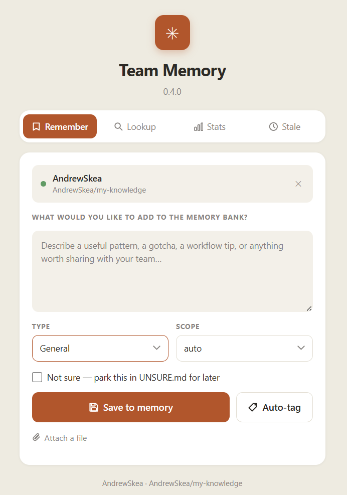

<div align="center">

# team-memory

**Shared, version-controlled knowledge base your whole team builds together**

Git-saved, but locally in your CLI or UI.

[](LICENSE)

</div>

---

Most team knowledge lives in people's heads, scattered Slack threads, or stale wikis nobody trusts. team-memory is different: it lives in a Git repo your team already owns, every entry is a commit, and anyone can open the web UI and jot something down in seconds.

Two ways to build it up:

- **Web UI** — lightweight note-taking interface at `http://team-mem`. Capture a decision, a gotcha, a workflow pattern — whenever it crosses your mind, not just at the end of a session
- **Claude Code hook** — fires automatically when a session ends, summarises what was built, and commits a structured entry hands-free



---

## Features

| | |
|---|---|
| **Auto-save sessions** | Hook fires when Claude Code ends, summarises with Claude, commits structured entry to your repo |
| **Web UI** | Browse, save, lookup, and flag stale entries at `http://127.0.0.1:7438` |
| **Smart categorisation** | LLM picks the right file from your index — or skip it and save directly |
| **GitHub-backed storage** | Plain Markdown in a repo you own — edit, search, and version-control it directly |
| **MCP server** | Claude Code can read and write your knowledge base mid-session |
| **No telemetry** | Binds `127.0.0.1` only, never phones home |

---

## Install

**macOS / Linux**
```sh
curl -LsSf https://raw.githubusercontent.com/AndrewSkea/team-memory/master/install.sh | sh
```

**Windows (PowerShell)**
```powershell
irm https://raw.githubusercontent.com/AndrewSkea/team-memory/master/install.ps1 | iex
```

The installer downloads the binary, adds it to `~/bin` (or `%USERPROFILE%\bin` on Windows), prompts for your GitHub PAT and memory repo, wires `Stop`/`PreCompact` hooks into `~/.claude/settings.json`, and registers the MCP server in `~/.claude.json`. Config is written with mode `600` on Unix.

> **Prerequisites:** a GitHub repo and a fine-grained PAT with `contents:write` on that repo.
>
> **What needs elevated privileges?** On Linux/macOS, `install.sh` only calls `sudo` if you pick service mode — to append `127.0.0.1 team-mem` to `/etc/hosts` and (Linux) `setcap cap_net_bind_service` on the binary so it can bind port 80. Skip service mode to avoid `sudo` entirely. On Windows, `install.ps1` requires no admin by default; running it elevated additionally configures `netsh portproxy` and the hosts entry.
>
> **Binary install location trust:** the binary lives under your user profile (`~/bin` or `%USERPROFILE%\bin`). Anything that can write there can replace the binary — keep that directory's ACL/permissions as they default for your user. For a multi-user machine, install to a system path manually and run from there instead.

### Service mode (always-on web UI)

The installer offers two run modes. Service mode keeps the web UI available at all times:

| | Non-admin (default) | Admin (`Run as Administrator`) |
|---|---|---|
| Autostart | Registry `HKCU\...\Run` key | Task Scheduler (`RunLevel Highest`) |
| Browser URL | `http://127.0.0.1:7438/` | `http://team-mem/` |
| `team-mem` hostname | Manual (see below) | Auto-added to hosts file |
| Port 80 redirect | — | `netsh interface portproxy` 80 → 7438 |

To get the `http://team-mem/` shortcut without re-running as admin, add one line to `C:\Windows\System32\drivers\etc\hosts` (requires admin once):
```
127.0.0.1 team-mem
```
Then access via `http://team-mem:7438/` (no portproxy without admin).

---

## Usage

After install, use Claude Code normally. When a session ends, `team-memory-mcp` automatically summarises it and commits a structured entry to your memory repo. Open `http://127.0.0.1:7438` to browse your knowledge base, save entries manually, or search by keyword.

### Model & cost

All LLM calls (categorisation, summary, reminders) go through the `claude` CLI pinned to **Haiku** (`--model haiku`). Haiku is roughly an order of magnitude cheaper than Sonnet/Opus and is more than adequate for these short, structured generations. Override per-process with the `TEAM_MEMORY_MODEL` env var if you ever want a bigger model:

```sh
TEAM_MEMORY_MODEL=sonnet team-memory-mcp
```

---

## Privacy & Security

- PAT and Anthropic key stored in `~/.config/team-memory/config.json` (CLI) and browser `localStorage` (web UI)
- Binary binds `127.0.0.1` only — never exposed to the network
- No telemetry, no third-party scripts

See [SECURITY.md](SECURITY.md) for the full threat model.

---

## Contributing

See [CONTRIBUTING.md](CONTRIBUTING.md) for build instructions, project layout, and code style.

```bash
make build   # build binary locally
make test    # run all tests
```

---

<div align="center">

[MIT License](LICENSE) · © Andrew Skea

</div>
